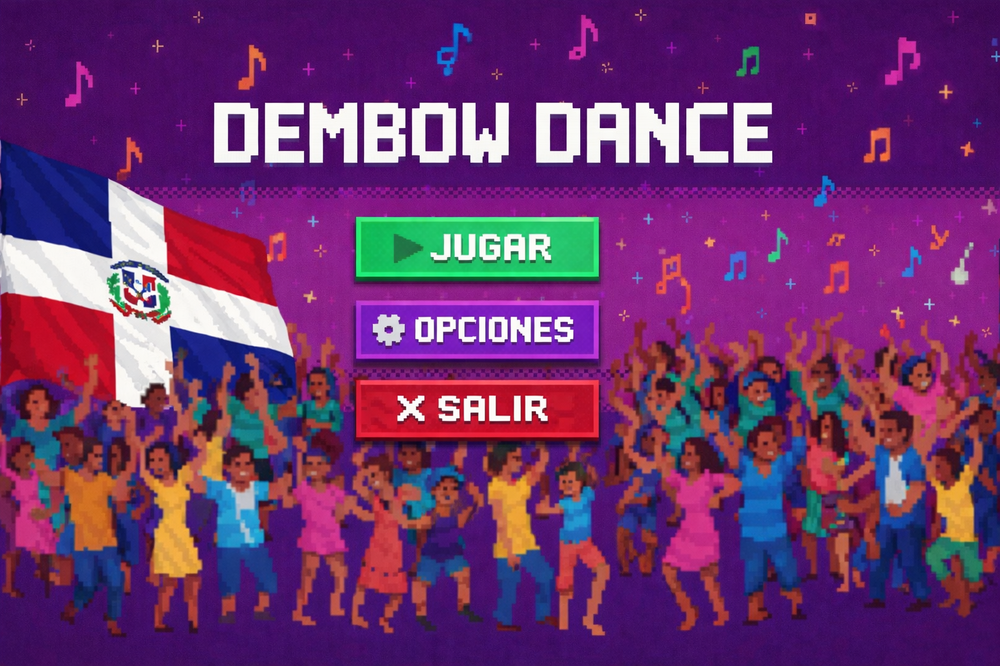
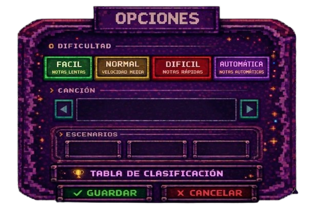

# 🇩🇴 Dembow Dance
**Rhythm game dominicano desarrollado en Unity 6** *Proyecto Final - ISW-414 Programación de Videojuegos*

## Información del Estudiante
* **Nombre:** Yulenny Bonilla
* **Matrícula:** 2023-0769
* **Universidad:** Universidad Central del Este (UCE)
* **Profesor:** Ivan Zorrilla
* **Fecha:** Abril 2026

## Descripción
**Dembow Dance** es un juego de ritmo (rhythm game) que celebra la cultura urbana dominicana. El objetivo es presionar las flechas en el momento exacto en que las notas cruzan la zona de impacto al ritmo de los mejores tracks de dembow. El juego incluye un sistema de "fuego" visual para rachas perfectas y una dificultad progresiva que desafía hasta a los más veteranos.

## Controles
* ⬅️ **Flecha Izquierda**: Carril 1
* ⬇️ **Flecha Abajo**: Carril 2
* ⬆️ **Flecha Arriba**: Carril 3
* ➡️ **Flecha Derecha**: Carril 4
* ⌨️ **Esc**: Pausar el juego / Menú de ajustes

## Características (Features)
* **Dificultad Progresiva:** Sistema "Automático" donde la velocidad aumenta según el progreso de la canción.
* **Sistema de Combo:** Multiplicador de puntos por aciertos consecutivos.
* **Leaderboard Local:** Registro de los 10 mejores puntajes con nombre y dificultad.
* **Feedback Visual:** Pantalla que vibra (Shake) al recibir daño y efectos de partículas de fuego en rachas de "Perfect".
* **Personalización:** Selector de 3 escenarios icónicos (Noche Dembow, Calles Dominicanas, Azotea).

## Screenshots

## Tecnologías Utilizadas
* **Engine:** Unity 6
* **Lenguaje:** C# (Scripts organizados por responsabilidades)
* **UI:** TextMeshPro para fuentes pixel art.
* **Control de Versiones:** Git & GitHub.

